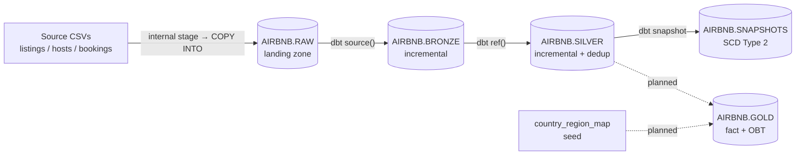

# Airbnb Data Warehouse — Snowflake + dbt

An end-to-end ELT pipeline modelling Airbnb listings, hosts and bookings on Snowflake, built with dbt Core. Implements a medallion architecture with incremental loading, Slowly Changing Dimension (Type 2) history tracking, role-based access control and cost controls.

> **Status:** actively developed. Bronze and Silver layers are complete and running; the Gold layer and test suite are in progress — see [Roadmap](#roadmap). Work is tracked on a [GitHub Projects board](https://github.com/mouda4d/airbnb-snowflake-dbt/issues) as epics and user stories with explicit Definitions of Done.

## Architecture



| Layer | Contract | Implementation |
|---|---|---|
| **RAW** | Landing zone, untouched | Internal stage + `COPY INTO`, idempotent by file checksum |
| **Bronze** | Faithful 1:1 with source, no business logic | Incremental models, `unique_key` upserts |
| **Silver** | Clean, conformed, grain enforced | Null handling, `QUALIFY`/`ROW_NUMBER` dedup, incremental |
| **Snapshots** | Historical change tracking | SCD Type 2 via `check` strategy |
| **Gold** | Purpose-built for consumption | *In progress* |

## Stack

Snowflake · dbt Core 1.12 · Python 3.11 · Git / GitHub Projects

## Engineering decisions

Decisions made deliberately, with tradeoffs, rather than by default:

- **Key-pair authentication** instead of password auth — Snowflake is retiring password authentication for programmatic access, so the project uses RSA key-pair auth from the start. This also makes the pipeline CI-ready, since it requires no interactive login.
- **Scoped `TRANSFORMER` role** rather than `ACCOUNTADMIN` for day-to-day work. `ACCOUNTADMIN` is used only where Snowflake genuinely requires it (resource monitor creation). This limits the blast radius of a bad run to what the role can actually touch.
- **Cost controls from day one** — `AUTO_SUSPEND = 60s` on the warehouse plus a resource monitor with notify/suspend triggers, so an accidental runaway query can't drain the account.
- **Internal stage rather than S3.** `COPY INTO` mechanics are identical either way; an internal stage avoids a second cloud account and IAM configuration for no learning or architectural loss. The external-stage variant is on the roadmap.
- **`check` snapshot strategy, not `timestamp`.** dbt recommends `timestamp`, but this source data has no reliable `updated_at` — its `created_at` is dataset-generation metadata, identical across every row. Using `timestamp` here would silently detect no changes at all. `check` costs more configuration and must be maintained as the schema evolves, but is the only correct option for this source.
- **`dbt_valid_to_current: '9999-12-31'`** instead of dbt's default `NULL`, so point-in-time joins can use a plain `BETWEEN`-style range predicate rather than needing an `OR dbt_valid_to IS NULL` branch that is easy to omit.
- **`generate_schema_name` overridden** so models land in clean `BRONZE` / `SILVER` / `SNAPSHOTS` schemas. dbt's default concatenates the target schema (`PUBLIC_bronze`) to isolate developers from each other; that isolation is unnecessary for a single-developer project, and the tradeoff is explicit rather than accidental.
- **`unique_key` on every incremental model.** Incremental dedup logic only sees the current batch — it cannot compare against rows already in the target. `unique_key` makes dbt emit a `MERGE` instead of an append, so uniqueness holds across runs rather than only within one.

## Project structure

```
├── ddl/                  # Versioned Snowflake setup: database, RBAC, stage, raw tables, migrations
├── models/
│   ├── sources.yml       # Source declarations (RAW schema)
│   ├── bronze/           # 1:1 passthrough, incremental
│   └── silver/           # Cleaned, deduplicated, incremental
├── snapshots/            # SCD Type 2 definitions (YAML)
├── seeds/                # Static reference data
├── analyses/             # Compiled-but-not-executed analytical SQL
├── macros/               # Custom macros (schema routing)
├── scripts/              # Source data fetch
└── SourceData/           # Input CSVs
```

## Getting started

**Prerequisites:** Python 3.10+, a Snowflake account, git.

```bash
# 1. Clone and create a virtual environment
git clone https://github.com/mouda4d/airbnb-snowflake-dbt.git
cd airbnb-snowflake-dbt
python -m venv .venv && source .venv/Scripts/activate   # Windows (Git Bash)

# 2. Install dbt
pip install dbt-snowflake

# 3. Configure ~/.dbt/profiles.yml with your Snowflake connection (key-pair auth)
#    See https://docs.getdbt.com/docs/core/connect-data-platform/snowflake-setup
dbt debug

# 4. Fetch source data
bash scripts/fetch_source_data.sh

# 5. Run the Snowflake setup scripts in order (ddl/00 through ddl/05),
#    then upload the CSVs from SourceData/ to the internal stage

# 6. Build
dbt build      # models + seeds + tests, in dependency order
dbt snapshot   # SCD Type 2 history
```

## Roadmap

Tracked as issues on the project board:

- [ ] **Gold layer** — fact table and One Big Table, joining the currently independent bronze→silver chains
- [ ] **Test suite** — `unique` / `not_null` / `relationships` tests, plus custom data quality tests. Uniqueness is currently guaranteed by `unique_key` configuration but not yet *verified* by a test
- [ ] **Source freshness** monitoring
- [ ] **Published dbt docs** with lineage graph
- [ ] **CI/CD** — GitHub Actions running `dbt build` on pull requests
- [ ] External stage (S3) variant alongside the internal stage

## Notes

The source dataset is synthetic. Two characteristics shaped real design decisions: `created_at` is identical across all rows (dataset-generation metadata rather than a genuine load timestamp), and there is no `updated_at` column at all. Both are documented above where they affected implementation choices.
